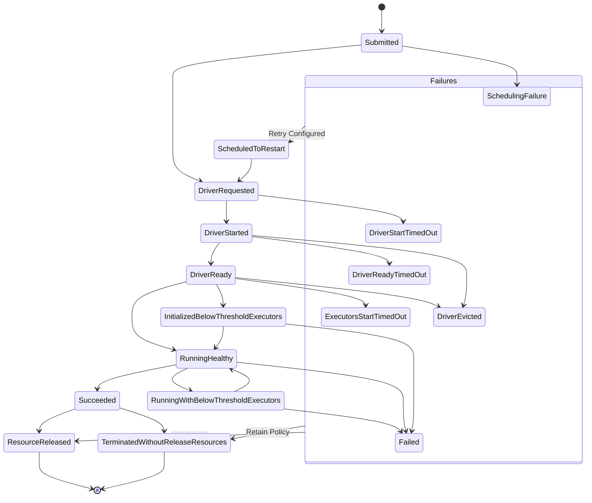
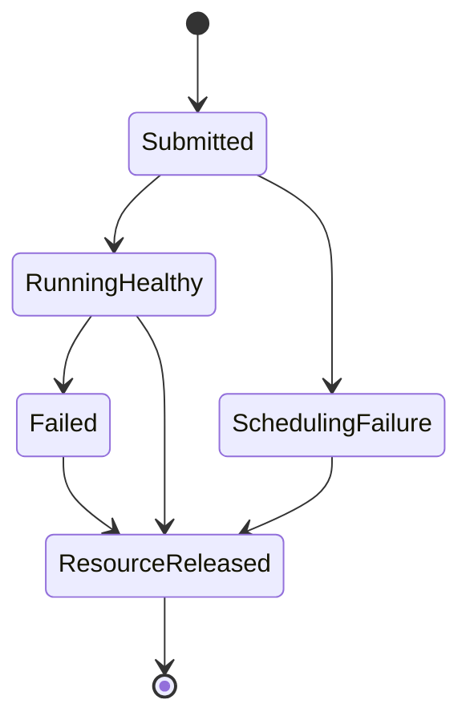

<!--
Licensed to the Apache Software Foundation (ASF) under one
or more contributor license agreements.  See the NOTICE file
distributed with this work for additional information
regarding copyright ownership.  The ASF licenses this file
to you under the Apache License, Version 2.0 (the
"License"); you may not use this file except in compliance
with the License.  You may obtain a copy of the License at

  http://www.apache.org/licenses/LICENSE-2.0

Unless required by applicable law or agreed to in writing,
software distributed under the License is distributed on an
"AS IS" BASIS, WITHOUT WARRANTIES OR CONDITIONS OF ANY
KIND, either express or implied.  See the License for the
specific language governing permissions and limitations
under the License.
-->

# Design & Architecture

**Spark-Kubernetes-Operator** (Operator) acts as a control plane to manage the complete
deployment lifecycle of Spark applications and clusters. The Operator can be installed on Kubernetes
cluster(s) using Helm. In most production environments it is typically deployed in a designated
namespace and controls Spark workload in one or more managed namespaces.
Spark Operator enables user to describe Spark application(s) or cluster(s) as
[Custom Resources](https://kubernetes.io/docs/concepts/extend-kubernetes/api-extension/custom-resources/).

The Operator continuously tracks events related to the Spark custom resources in its reconciliation
loops:

For SparkApplications:

* User submits a SparkApplication custom resource(CR) using kubectl / API
* Operator launches driver and observes its status
* Operator observes driver-spawn resources (e.g. executors) and record status till app terminates
* Operator releases all Spark-app owned resources to cluster

For SparkClusters:

* User submits a SparkCluster custom resource(CR) using kubectl / API
* Operator launches master and worker(s) based on CR spec and observes their status
* Operator releases all Spark-cluster owned resources to cluster upon failure

The Operator is built with the [Java Operator SDK](https://javaoperatorsdk.io/) for
launching Spark deployments and submitting jobs under the hood. It also uses
[fabric8](https://fabric8.io/) client to interact with Kubernetes API Server.

## Application State Transition

* Spark applications are expected to run from submitted to succeeded before releasing resources
* User may configure the app CR to time-out after given threshold of time if it cannot reach healthy
  state after given threshold. The timeout can be configured for different lifecycle stages,
  when driver starting and when requesting executor pods. To update the default threshold,  
  configure `.spec.applicationTolerations.applicationTimeoutConfig` for the application.
* K8s resources created for an application would be deleted as the final stage of the application
  lifecycle by default. This is to ensure resource quota release for completed applications.  
* It is also possible to retain the created k8s resources for debug or audit purpose. To do so,
  user may set `.spec.applicationTolerations.resourceRetainPolicy` to `OnFailure` to retain
  resources upon application failure, or set to `Always` to retain resources regardless of
  application final state.
  * This controls the behavior of k8s resources created by Operator for the application, including
      driver pod, config map, service, and PVC(if enabled). This does not apply to resources created
      by driver (for example, executor pods). User may configure SparkConf to
      include `spark.kubernetes.executor.deleteOnTermination` for executor retention. Please refer
      [Spark docs](https://spark.apache.org/docs/latest/running-on-kubernetes.html) for details.
  * The created k8s resources have `ownerReference` to their related `SparkApplication` custom
      resource, such that they could be garbage collected when the `SparkApplication` is deleted.
  * Please be advised that k8s resources would not be retained if the application is configured to
      restart. This is to avoid resource quota usage increase unexpectedly or resource conflicts
      among multiple attempts.

## Cluster State Transition

* Spark clusters are expected to be always running after submitted.
* Similar to Spark applications, K8s resources created for a cluster would be deleted as the final
  stage of the cluster lifecycle by default.
