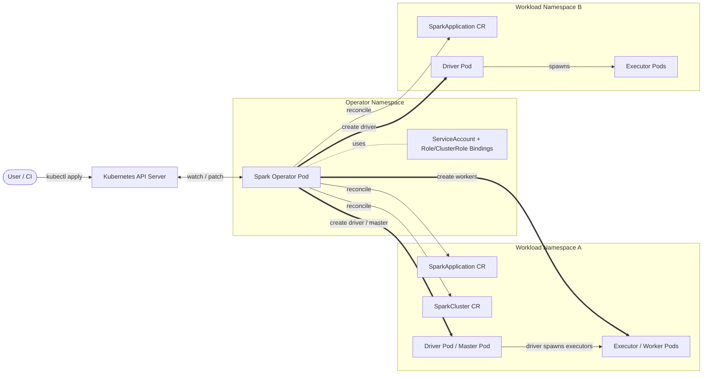
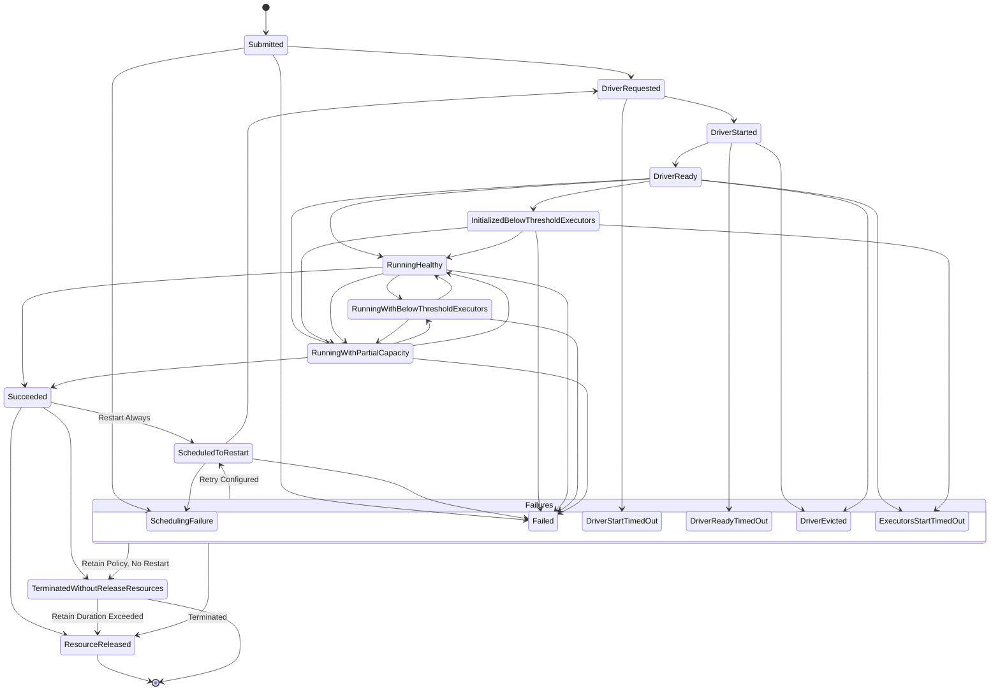
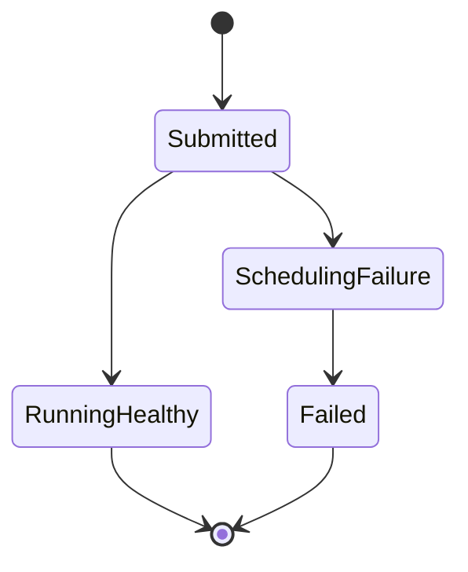

<!--
Licensed to the Apache Software Foundation (ASF) under one
or more contributor license agreements.  See the NOTICE file
distributed with this work for additional information
regarding copyright ownership.  The ASF licenses this file
to you under the Apache License, Version 2.0 (the
"License"); you may not use this file except in compliance
with the License.  You may obtain a copy of the License at

  http://www.apache.org/licenses/LICENSE-2.0

Unless required by applicable law or agreed to in writing,
software distributed under the License is distributed on an
"AS IS" BASIS, WITHOUT WARRANTIES OR CONDITIONS OF ANY
KIND, either express or implied.  See the License for the
specific language governing permissions and limitations
under the License.
-->

# Design & Architecture

**Spark-Kubernetes-Operator** (Operator) acts as a control plane to manage the complete
deployment lifecycle of Spark applications and clusters. The Operator can be installed on Kubernetes
cluster(s) using Helm. In most production environments it is typically deployed in a designated
namespace and controls Spark workload in one or more managed namespaces.
Spark Operator enables user to describe Spark application(s) or cluster(s) as
[Custom Resources](https://kubernetes.io/docs/concepts/extend-kubernetes/api-extension/custom-resources/).

The Operator continuously tracks events related to the Spark custom resources in its reconciliation
loops:

For SparkApplications:

* User submits a SparkApplication custom resource(CR) using kubectl / API
* Operator launches driver and observes its status
* Operator observes driver-spawn resources (e.g. executors) and record status till app terminates
* Operator releases all Spark-app owned resources to cluster

For SparkClusters:

* User submits a SparkCluster custom resource(CR) using kubectl / API
* Operator launches master and worker(s) based on CR spec and observes their status
* Spark-cluster owned resources are garbage collected when the SparkCluster CR is deleted

The Operator is built with the [Java Operator SDK](https://javaoperatorsdk.io/) for
launching Spark deployments and submitting jobs under the hood. It also uses
[fabric8](https://fabric8.io/) client to interact with Kubernetes API Server.

## Deployment Topology

A typical installation places the Operator pod in one dedicated namespace while it watches
Spark custom resources in one or more workload namespaces. RBAC is scoped by the Helm chart:
the Operator ServiceAccount is bound to the permissions required to manage
`SparkApplication` / `SparkCluster` resources and their child Kubernetes objects.

```mermaid
flowchart LR
    user([User / CI]) -->|kubectl apply| api[Kubernetes API Server]

    subgraph operatorNs[Operator Namespace]
        op[Spark Operator Pod]
        sa[ServiceAccount + Role/ClusterRole Bindings]
        op -.uses.- sa
    end

    subgraph workloadA[Workload Namespace A]
        crA1[SparkApplication CR]
        crA2[SparkCluster CR]
        drvA[Driver Pod / Master Pod]
        execA[Executor / Worker Pods]
    end

    subgraph workloadB[Workload Namespace B]
        crB[SparkApplication CR]
        drvB[Driver Pod]
        execB[Executor Pods]
    end

    api <-->|watch / patch| op
    op -->|reconcile| crA1
    op -->|reconcile| crA2
    op -->|reconcile| crB
    op ==>|create driver / master| drvA
    op ==>|create workers| execA
    op ==>|create driver| drvB
    drvA -->|driver spawns executors| execA
    drvB -->|spawns| execB
```

Multiple Operator instances can coexist on the same cluster (for example one per region or per
tenant) as long as each uses a distinct ClusterRole / ClusterRoleBinding name and a disjoint set of
watched namespaces. See [operations.md](operations.md) for a concrete multi-instance example.

## Application State Transition

```mermaid
stateDiagram-v2

    [*] --> Submitted

    Submitted --> DriverRequested
    Submitted --> SchedulingFailure
    Submitted --> Failed

    ScheduledToRestart --> DriverRequested
    ScheduledToRestart --> SchedulingFailure
    ScheduledToRestart --> Failed

    DriverRequested --> DriverStarted
    DriverRequested --> DriverStartTimedOut

    DriverStarted --> DriverReady
    DriverStarted --> DriverReadyTimedOut
    DriverStarted --> DriverEvicted

    DriverReady --> RunningHealthy
    DriverReady --> InitializedBelowThresholdExecutors
    DriverReady --> RunningWithPartialCapacity
    DriverReady --> ExecutorsStartTimedOut
    DriverReady --> DriverEvicted

    InitializedBelowThresholdExecutors --> RunningHealthy
    InitializedBelowThresholdExecutors --> RunningWithPartialCapacity
    InitializedBelowThresholdExecutors --> ExecutorsStartTimedOut
    InitializedBelowThresholdExecutors --> Failed

    RunningHealthy --> Succeeded
    RunningHealthy --> RunningWithBelowThresholdExecutors
    RunningHealthy --> RunningWithPartialCapacity
    RunningHealthy --> Failed

    RunningWithBelowThresholdExecutors --> RunningWithPartialCapacity
    RunningWithBelowThresholdExecutors --> RunningHealthy
    RunningWithBelowThresholdExecutors --> Failed

    RunningWithPartialCapacity --> RunningWithBelowThresholdExecutors
    RunningWithPartialCapacity --> RunningHealthy
    RunningWithPartialCapacity --> Succeeded
    RunningWithPartialCapacity --> Failed

    state Failures {
        SchedulingFailure
        DriverStartTimedOut
        DriverReadyTimedOut
        ExecutorsStartTimedOut
        DriverEvicted
        Failed
    }

    Failures --> ScheduledToRestart : Retry Configured
    Failures --> ResourceReleased : Terminated

    Succeeded --> ScheduledToRestart : Restart Always
    Succeeded --> ResourceReleased
    ResourceReleased --> [*]

    %% Place TerminatedWithoutReleaseResources further to avoid overlap
    Failures --> TerminatedWithoutReleaseResources : Retain Policy, No Restart
    Succeeded --> TerminatedWithoutReleaseResources
    TerminatedWithoutReleaseResources --> ResourceReleased : Retain Duration Exceeded
    TerminatedWithoutReleaseResources --> [*]
```

* Spark applications are expected to run from submitted to succeeded before releasing resources
* Once the driver is requested, an application moves to `Succeeded`, `Failed` or `DriverEvicted`
  from any of the states above whenever the driver pod terminates or is evicted. It also moves to
  `Failed` if the driver pod is removed unexpectedly.
* User may configure the app CR to time-out after given threshold of time if it cannot reach healthy
  state after given threshold. The timeout can be configured for different lifecycle stages,
  when driver starting, when driver becoming ready, and when requesting executor pods.
  To update the default threshold,  
  configure `.spec.applicationTolerations.applicationTimeoutConfig` for the application.
* K8s resources created for an application would be deleted as the final stage of the application
  lifecycle by default. This is to ensure resource quota release for completed applications.  
* It is also possible to retain the created k8s resources for debug or audit purpose. To do so,
  user may set `.spec.applicationTolerations.resourceRetainPolicy` to `OnFailure` to retain
  resources upon application failure, or set to `Always` to retain resources regardless of
  application final state.
  * This controls the behavior of k8s resources created by Operator for the application, including
      driver pod, config map, service, and PVC(if enabled). This does not apply to resources created
      by driver (for example, executor pods). User may configure SparkConf to
      include `spark.kubernetes.executor.deleteOnTermination` for executor retention. Please refer
      [Spark docs](https://spark.apache.org/docs/latest/running-on-kubernetes.html) for details.
  * The driver pod has `ownerReference` to its related `SparkApplication` custom resource, and the
      other created k8s resources have `ownerReference` to the driver pod, such that they could be
      garbage collected when the `SparkApplication` is deleted. The Kueue `Workload`, created when
      a queue name is set, is owned by the `SparkApplication` directly and is released by Operator.
  * Please be advised that k8s resources would not be retained if the application is configured to
      restart. This is to avoid resource quota usage increase unexpectedly or resource conflicts
      among multiple attempts.

## Cluster State Transition

```mermaid
stateDiagram-v2

    [*] --> Submitted

    Submitted --> RunningHealthy
    Submitted --> SchedulingFailure

    SchedulingFailure --> Failed

    RunningHealthy --> [*]
    Failed --> [*]
```

* Spark clusters are expected to be always running after submitted.
* A cluster leaves `RunningHealthy` or `Failed` only when its custom resource is deleted. At that
  point, the K8s resources created for the cluster are garbage collected through their
  `ownerReference` to the `SparkCluster` custom resource.
* A `Failed` cluster is not reconciled any further.
* `ResourceReleased` exists in the API enum but is currently not used for clusters.
