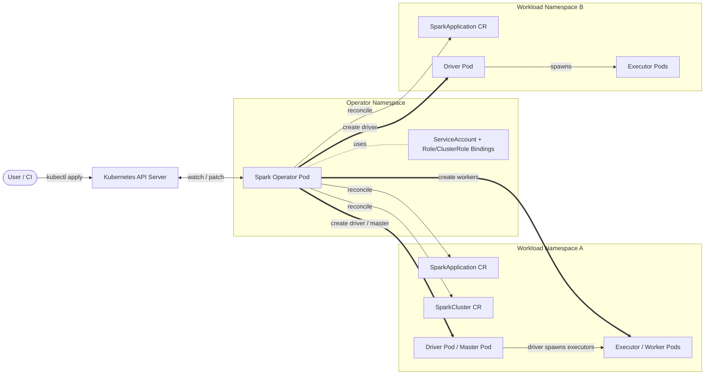
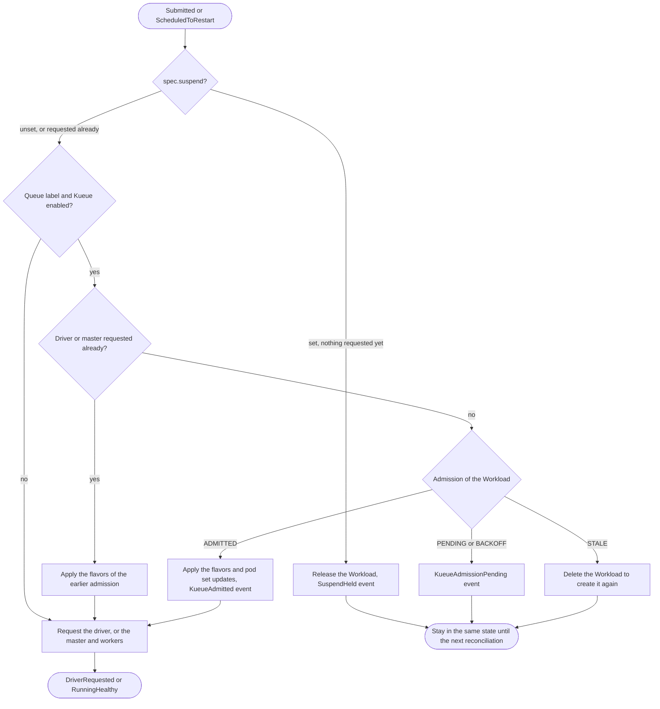
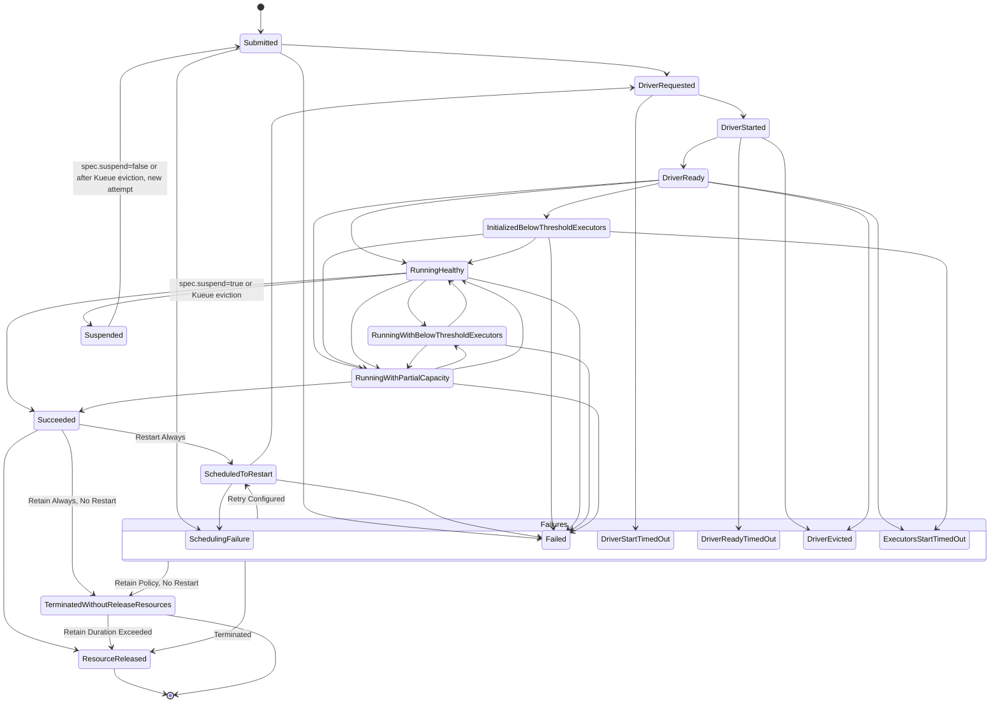
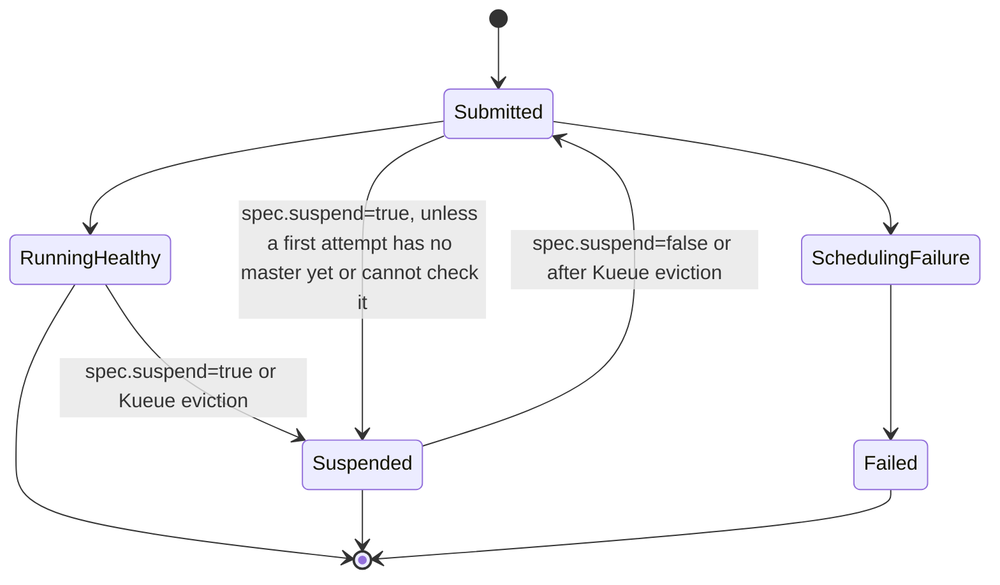

<!--
Licensed to the Apache Software Foundation (ASF) under one
or more contributor license agreements.  See the NOTICE file
distributed with this work for additional information
regarding copyright ownership.  The ASF licenses this file
to you under the Apache License, Version 2.0 (the
"License"); you may not use this file except in compliance
with the License.  You may obtain a copy of the License at

  http://www.apache.org/licenses/LICENSE-2.0

Unless required by applicable law or agreed to in writing,
software distributed under the License is distributed on an
"AS IS" BASIS, WITHOUT WARRANTIES OR CONDITIONS OF ANY
KIND, either express or implied.  See the License for the
specific language governing permissions and limitations
under the License.
-->

# Design & Architecture

**Spark-Kubernetes-Operator** (Operator) acts as a control plane to manage the complete
deployment lifecycle of Spark applications and clusters. The Operator can be installed on Kubernetes
cluster(s) using Helm. In most production environments it is typically deployed in a designated
namespace and controls Spark workload in one or more managed namespaces.
Spark Operator enables user to describe Spark application(s) or cluster(s) as
[Custom Resources](https://kubernetes.io/docs/concepts/extend-kubernetes/api-extension/custom-resources/).

The Operator continuously tracks events related to the Spark custom resources in its reconciliation
loops:

For SparkApplications:

* User submits a SparkApplication custom resource(CR) using kubectl / API
* Operator launches driver and observes its status
* Operator observes driver-spawn resources (e.g. executors) and record status till app terminates
* Operator releases all Spark-app owned resources to cluster

For SparkClusters:

* User submits a SparkCluster custom resource(CR) using kubectl / API
* Operator launches master and worker(s) based on CR spec and observes their status
* Spark-cluster owned resources are garbage collected when the SparkCluster CR is deleted

The Operator is built with the [Java Operator SDK](https://javaoperatorsdk.io/) for
launching Spark deployments and submitting jobs under the hood. It also uses
[fabric8](https://fabric8.io/) client to interact with Kubernetes API Server.

## Deployment Topology

A typical installation places the Operator pod in one dedicated namespace while it watches
Spark custom resources in one or more workload namespaces. RBAC is scoped by the Helm chart:
the Operator ServiceAccount is bound to the permissions required to manage
`SparkApplication` / `SparkCluster` resources and their child Kubernetes objects.

```mermaid
flowchart LR
    user([User / CI]) -->|kubectl apply| api[Kubernetes API Server]

    subgraph operatorNs[Operator Namespace]
        op[Spark Operator Pod]
        sa[ServiceAccount + Role/ClusterRole Bindings]
        op -.uses.- sa
    end

    subgraph workloadA[Workload Namespace A]
        crA1[SparkApplication CR]
        crA2[SparkCluster CR]
        drvA[Driver Pod / Master Pod]
        execA[Executor / Worker Pods]
    end

    subgraph workloadB[Workload Namespace B]
        crB[SparkApplication CR]
        drvB[Driver Pod]
        execB[Executor Pods]
    end

    api <-->|watch / patch| op
    op -->|reconcile| crA1
    op -->|reconcile| crA2
    op -->|reconcile| crB
    op ==>|create driver / master| drvA
    op ==>|create workers| execA
    op ==>|create driver| drvB
    drvA -->|driver spawns executors| execA
    drvB -->|spawns| execB
```

Multiple Operator instances can coexist on the same cluster (for example one per region or per
tenant) as long as each uses a distinct ClusterRole / ClusterRoleBinding name and a disjoint set of
watched namespaces. See [operations.md](operations.md) for a concrete multi-instance example.

## Kueue Admission and Workload Lifecycle

A `SparkApplication` or a `SparkCluster` labeled with `kueue.x-k8s.io/queue-name` is queued by
[Kueue](https://kueue.sigs.k8s.io/) when `spark.kubernetes.operator.kueue.enabled` is set, which the
Helm chart sets with `operatorRbac.kueue.enabled` along with the RBAC rules for Kueue. The setting
also registers the `Workload` informer, while without it, the label is ignored with the
`KueueDisabled` warning event and the Operator does not access Kueue at all. For a queued resource,
the Operator creates a Kueue `Workload` with the pod sets of its driver and executors (or master and
workers), and requests the driver (or the master and workers) only once Kueue admits the
`Workload`. Applications and clusters share this mechanism. This section relates it to the
reconciliation and the state machines below, while [Suspend](spark_custom_resources.md#suspend)
and [Kueue](spark_custom_resources.md#kueue) describe the behavior in detail.

Waiting for the admission is not a state but a hold within the initialization step, like waiting
for `spec.suspend` to be cleared, so the resource stays in `Submitted`, or `ScheduledToRestart` for
a restarted application attempt, meanwhile. `AppInitStep` and `ClusterInitStep` decide as follows.

```mermaid
flowchart TD
    init([Submitted or ScheduledToRestart]) --> suspend{spec.suspend?}
    suspend -->|set, nothing requested yet| suspendHold[Release the Workload, SuspendHeld event]
    suspend -->|unset, or requested already| queued{Queue label and Kueue enabled?}
    queued -->|no| request[Request the driver, or the master and workers]
    queued -->|yes| requested{Driver or master requested already?}
    requested -->|yes| reapply[Apply the flavors of the earlier admission]
    requested -->|no| admission{Admission of the Workload}
    admission -->|PENDING or BACKOFF| kueueHold[KueueAdmissionPending event]
    admission -->|STALE| stale[Delete the Workload to create it again]
    admission -->|ADMITTED| admitted[Apply the flavors and pod set updates, KueueAdmitted event]
    reapply --> request
    admitted --> request
    request --> next([DriverRequested or RunningHealthy])
    suspendHold --> hold([Stay in the same state until the next reconciliation])
    kueueHold --> hold
    stale --> hold
```

* `spec.suspend` comes first (`SuspendUtils`), so a suspended resource is held without a
  `Workload`, and suspending a queued one releases its `Workload`. A cluster resumed from
  `Suspended` moves back to `Suspended` instead of being held. After the restart backoff of a
  restarted attempt, `KueueWorkloadUtils` creates the `Workload` unless it exists, and finds it
  `ADMITTED`, `PENDING`, `BACKOFF` if it is evicted and its requeue backoff has not elapsed, or
  `STALE` if it is owned by another resource, still pending for an outdated spec, evicted after the
  backoff, or being deleted.
* Once the `Workload` is admitted, the `nodeLabels` and `tolerations` of the `ResourceFlavor`s
  assigned to it and the pod set updates of its admission checks are applied to the driver and
  executor pod templates of a copy of the `SparkApplication`, which the driver resources are built
  from, or to the pod templates of the master and worker `StatefulSet`s. Neither the custom
  resource nor the `Workload` is changed.
* A driver or master which was requested already, e.g. when the status update after the request
  failed, is not held and requests no admission, since it has to complete the initialization
  rather than run unobserved. Its resources are applied again in that reconciliation, so the
  flavors of the earlier admission are applied again as well, rather than dropped from them.
* A hold changes no state. The initial `Submitted` state of a first attempt is not persisted to the
  API server until the next state, so `kubectl get` shows an empty `Current State`, and the
  `SuspendHeld`, `KueueAdmissionPending` and `KueueAdmitted`
  [events](configuration.md#kubernetes-events) show the progress instead. A hold completes the
  reconciliation with a requeue, after `spark.kubernetes.operator.reconciler.intervalSeconds` while
  the `Workload` is pending, or after
  `spark.kubernetes.operator.reconciler.suspendHoldRequeueIntervalSeconds` for `spec.suspend`, and
  the next reconciliation decides again in the same order, which requests the admission again and
  republishes the event.
* The `Workload` informer reconciles the resource as soon as the admission, the eviction or the
  activation of its `Workload` changes, or the `Workload` is deleted, so that an admission starts
  the resource right away rather than at the next requeue. It ignores the creation of the
  `Workload` and its other updates, e.g. of the status of a pending one, which would use up the
  per-resource rate limit.
* A `Workload` which Kueue evicts before the driver or master is requested is kept until the
  requeue backoff which Kueue records on it elapses, since its deletion would drop the backoff, and
  then it is deleted and created again, which queues the resource again. A deactivated `Workload`
  is kept as it is until it is reactivated, since Kueue neither counts nor admits it, and a new one
  would come back active.
* While the resource runs, the Operator records the `PodsReady` condition on its `Workload` once
  as many pods of each pod set as its `count` are ready, so that the `waitForPodsReady` timeout of
  Kueue does not evict it. `AppRunningStep` records it from `DriverReady` on, and
  `ClusterSuspendStep` while the cluster is `RunningHealthy`, which a cluster enters without
  waiting for its pods. It is recorded only once and never set back to `False`, since an eviction
  for a lost executor or worker, which Spark replaces, would run the resource again from scratch.
* The `Workload` is released at the following points. Kueue would admit another workload into the
  quota which terminating pods still occupy, so the Operator deletes it only after the pods are
  gone, unless they are stuck terminating, and the resource keeps its state until then.
  * When an application releases its resources, at the end of an attempt, when their retention
    expires, or when the application is deleted, `AppCleanUpStep` deletes the `Workload` before the
    application moves to `ResourceReleased` or `ScheduledToRestart`. The `Workload` name is fixed
    per resource, so a restarted attempt is queued with a new `Workload` rather than run on this
    admission.
  * When an application retains its resources as `TerminatedWithoutReleaseResources` after
    `Succeeded`, `Failed` or `DriverEvicted`, its `Workload` gets the Kueue `Finished` condition
    instead, which releases the quota while keeping the `Workload` with the resources, since the
    driver pod is in a terminal phase and no attempt follows.
  * When a resource enters `Suspended` by `spec.suspend` or by the eviction of its `Workload`,
    `AppSuspendStep` or `ClusterSuspendStep` releases the driver, or the master and workers, and
    then the `Workload`, an evicted one after its requeue backoff, and a deactivated one after it is
    reactivated. The resource then moves to `Submitted` and is queued again with a new `Workload`,
    once `spec.suspend` is cleared if it is set. The `suspendReason` of the `Suspended` state,
    `SpecSuspend` or `KueueEviction`, tells the two causes apart.
  * When a `SparkCluster` is deleted, its `Workload` is garbage collected through its
    `ownerReference`, like the other resources of the cluster.
* The Operator writes none of the `Workload` status which Kueue owns, such as the admission or the
  requeue state. It records only the `PodsReady` and `Finished` conditions, and releases or
  requeues a resource by deleting its `Workload` and creating a new one, so that the integration
  does not depend on how Kueue manages that status.

## Application State Transition

```mermaid
stateDiagram-v2

    [*] --> Submitted

    Submitted --> DriverRequested
    Submitted --> SchedulingFailure
    Submitted --> Failed

    ScheduledToRestart --> DriverRequested
    ScheduledToRestart --> SchedulingFailure
    ScheduledToRestart --> Failed

    DriverRequested --> DriverStarted
    DriverRequested --> DriverStartTimedOut

    DriverStarted --> DriverReady
    DriverStarted --> DriverReadyTimedOut
    DriverStarted --> DriverEvicted

    DriverReady --> RunningHealthy
    DriverReady --> InitializedBelowThresholdExecutors
    DriverReady --> RunningWithPartialCapacity
    DriverReady --> ExecutorsStartTimedOut
    DriverReady --> DriverEvicted

    InitializedBelowThresholdExecutors --> RunningHealthy
    InitializedBelowThresholdExecutors --> RunningWithPartialCapacity
    InitializedBelowThresholdExecutors --> ExecutorsStartTimedOut
    InitializedBelowThresholdExecutors --> Failed

    RunningHealthy --> Succeeded
    RunningHealthy --> RunningWithBelowThresholdExecutors
    RunningHealthy --> RunningWithPartialCapacity
    RunningHealthy --> Failed

    RunningWithBelowThresholdExecutors --> RunningWithPartialCapacity
    RunningWithBelowThresholdExecutors --> RunningHealthy
    RunningWithBelowThresholdExecutors --> Failed

    RunningWithPartialCapacity --> RunningWithBelowThresholdExecutors
    RunningWithPartialCapacity --> RunningHealthy
    RunningWithPartialCapacity --> Succeeded
    RunningWithPartialCapacity --> Failed

    RunningHealthy --> Suspended : spec.suspend=true or Kueue eviction
    Suspended --> Submitted : spec.suspend=false or after Kueue eviction, new attempt

    state Failures {
        SchedulingFailure
        DriverStartTimedOut
        DriverReadyTimedOut
        ExecutorsStartTimedOut
        DriverEvicted
        Failed
    }

    Failures --> ScheduledToRestart : Retry Configured
    Failures --> ResourceReleased : Terminated

    Succeeded --> ScheduledToRestart : Restart Always
    Succeeded --> ResourceReleased
    ResourceReleased --> [*]

    %% Place TerminatedWithoutReleaseResources further to avoid overlap
    Failures --> TerminatedWithoutReleaseResources : Retain Policy, No Restart
    Succeeded --> TerminatedWithoutReleaseResources : Retain Always, No Restart
    TerminatedWithoutReleaseResources --> ResourceReleased : Retain Duration Exceeded
    TerminatedWithoutReleaseResources --> [*]
```

* Spark applications are expected to run from submitted to succeeded before releasing resources
* An application stays in `Submitted` or `ScheduledToRestart` while it is held by `spec.suspend` or
  waits for the Kueue admission, since neither is a state of its own. See
  [Kueue Admission and Workload Lifecycle](#kueue-admission-and-workload-lifecycle).
* Once the driver is requested, an application moves to `Succeeded`, `Failed` or `DriverEvicted`
  from any of the states above whenever the driver pod terminates or is evicted. It also moves to
  `Failed` if the driver pod is removed unexpectedly.
* Likewise, an application moves to `Suspended` from any of the states from `DriverRequested` to
  `RunningWithBelowThresholdExecutors` when [`spec.suspend`](spark_custom_resources.md#suspend) is
  set to `true`. Its driver and executors are released, and setting it back to `false` starts a
  new attempt from `Submitted`, which does not count as a restart. An application queued by
  [Kueue](spark_custom_resources.md#kueue) is suspended as well when Kueue evicts its `Workload`,
  and starts such a new attempt once its driver and executors are released and the requeue
  backoff of its `Workload` elapsed, or once its `Workload` is reactivated if it was deactivated.
* User may configure the app CR to time-out after given threshold of time if it cannot reach healthy
  state after given threshold. The timeout can be configured for different lifecycle stages,
  when driver starting, when driver becoming ready, and when requesting executor pods.
  To update the default threshold,  
  configure `.spec.applicationTolerations.applicationTimeoutConfig` for the application.
* K8s resources created for an application would be deleted as the final stage of the application
  lifecycle by default. This is to ensure resource quota release for completed applications.  
* It is also possible to retain the created k8s resources for debug or audit purpose. To do so,
  user may set `.spec.applicationTolerations.resourceRetainPolicy` to `OnFailure` to retain
  resources upon application failure, or set to `Always` to retain resources regardless of
  application final state.
  * This controls the behavior of k8s resources created by Operator for the application, including
      driver pod, config map, service, and PVC(if enabled). This does not apply to resources created
      by driver (for example, executor pods). User may configure SparkConf to
      include `spark.kubernetes.executor.deleteOnTermination` for executor retention. Please refer
      [Spark docs](https://spark.apache.org/docs/latest/running-on-kubernetes.html) for details.
  * The driver pod has `ownerReference` to its related `SparkApplication` custom resource, and the
      other created k8s resources have `ownerReference` to the driver pod, such that they could be
      garbage collected when the `SparkApplication` is deleted. The Kueue `Workload`, created when
      a queue name is set, is owned by the `SparkApplication` directly and is released by Operator.
  * Please be advised that k8s resources would not be retained if the application is configured to
      restart. This is to avoid resource quota usage increase unexpectedly or resource conflicts
      among multiple attempts.

## Cluster State Transition

```mermaid
stateDiagram-v2

    [*] --> Submitted

    Submitted --> RunningHealthy
    Submitted --> SchedulingFailure

    SchedulingFailure --> Failed

    RunningHealthy --> Suspended : spec.suspend=true or Kueue eviction
    Suspended --> Submitted : spec.suspend=false or after Kueue eviction
    Submitted --> Suspended : spec.suspend=true, unless a first attempt has no master yet or cannot check it

    RunningHealthy --> [*]
    Suspended --> [*]
    Failed --> [*]
```

* Spark clusters are expected to be always running after submitted, until they are suspended by
  [`spec.suspend`](spark_custom_resources.md#suspend). A cluster queued by
  [Kueue](spark_custom_resources.md#kueue) is suspended as well when Kueue evicts its `Workload`,
  and moves to `Submitted` once its master and workers are released and the requeue backoff of its
  `Workload` elapsed, or once its `Workload` is reactivated if it was deactivated.
* Likewise, a cluster stays in `Submitted` while it waits for the Kueue admission, or while it is
  held by `spec.suspend` before it ever ran. See
  [Kueue Admission and Workload Lifecycle](#kueue-admission-and-workload-lifecycle).
* Apart from `spec.suspend` and a Kueue eviction, a cluster leaves `RunningHealthy`, `Suspended` or
  `Failed` only when its custom resource is deleted. At that point, the K8s resources created for the cluster are
  garbage collected through their `ownerReference` to the `SparkCluster` custom resource.
* A `Failed` cluster is not reconciled any further.
* `ResourceReleased` exists in the API enum but is currently not used for clusters.
