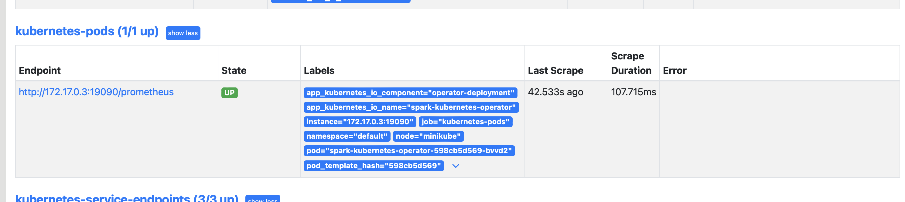

<!--
Licensed to the Apache Software Foundation (ASF) under one
or more contributor license agreements.  See the NOTICE file
distributed with this work for additional information
regarding copyright ownership.  The ASF licenses this file
to you under the Apache License, Version 2.0 (the
"License"); you may not use this file except in compliance
with the License.  You may obtain a copy of the License at

  http://www.apache.org/licenses/LICENSE-2.0

Unless required by applicable law or agreed to in writing,
software distributed under the License is distributed on an
"AS IS" BASIS, WITHOUT WARRANTIES OR CONDITIONS OF ANY
KIND, either express or implied.  See the License for the
specific language governing permissions and limitations
under the License.
-->

# Configuration

## Configure Operator

Spark Operator supports different ways to configure the behavior:

* **spark-operator.properties** provided when deploying the operator. In addition to the
  [property file](../build-tools/helm/spark-kubernetes-operator/conf/spark-operator.
  properties), it is also possible to override or append config properties in helm [Values
  files](../build-tools/helm/spark-kubernetes-operator/values.yaml).
* **System Properties** : when provided as system properties (e.g. via -D options to the
  operator JVM), it overrides the values provided in property file.
* **Hot property loading** : when enabled, a
  [configmap](https://kubernetes.io/docs/concepts/configuration/configmap/) would be created with
  the operator in the same namespace. Operator can monitor updates performed on the configmap. Hot
  properties reloading takes higher precedence comparing with default properties override.
  * An example use case: operator use hot properties to figure the list of namespace(s) to
      operate Spark applications. The hot properties config map can be updated and
      maintained by user or additional microservice to tune the operator behavior without
      rebooting it.
  * Please be advised that not all properties can be hot-loaded and honored at runtime.
      Refer the list of [supported properties](./config_properties.md) for more details.

To enable hot properties loading, update the **helm chart values file** with

```yaml
operatorConfiguration:
  spark-operator.properties: |+
    spark.operator.dynamic.config.enabled=true
    # ... all other config overides...
  dynamicConfig:
    create: true
```

## Metrics

Spark operator,
following [Apache Spark](https://spark.apache.org/docs/latest/monitoring.html#metrics),
has a configurable metrics system based on
the [Dropwizard Metrics Library](https://metrics.dropwizard.io/4.2.25/). Note that Spark Operator
does not have Spark UI, MetricsServlet
and PrometheusServlet from org.apache.spark.metrics.sink package are not supported. If you are
interested in Prometheus metrics exporting, please take a look at below
section [Forward Metrics to Prometheus](#forward-metrics-to-prometheus)

### JVM Metrics

Spark Operator collects JVM metrics
via [Codahale JVM Metrics](https://javadoc.io/doc/com.codahale.metrics/metrics-jvm/latest/index.html)

* BufferPoolMetricSet
* FileDescriptorRatioGauge
* GarbageCollectorMetricSet
* MemoryUsageGaugeSet
* ThreadStatesGaugeSet

### Kubernetes Client Metrics

| Metrics Name                                              | Type       | Description                                                                                                              |
|-----------------------------------------------------------|------------|--------------------------------------------------------------------------------------------------------------------------|
| kubernetes.client.http.request                            | Meter      | Tracking the rates of HTTP request sent to the Kubernetes API Server                                                     |
| kubernetes.client.http.response                           | Meter      | Tracking the rates of HTTP response from the Kubernetes API Server                                                       |
| kubernetes.client.http.response.failed                    | Meter      | Tracking the rates of HTTP requests which have no response from the Kubernetes API Server                                |
| kubernetes.client.http.response.latency.nanos             | Histograms | Measures the statistical distribution of HTTP response latency from the Kubernetes API Server                            |
| kubernetes.client.http.response.`ResponseCode`            | Meter      | Tracking the rates of HTTP response based on response code from the Kubernetes API Server                                |
| kubernetes.client.http.request.`RequestMethod`            | Meter      | Tracking the rates of HTTP request based type of method to the Kubernetes API Server                                     |
| kubernetes.client.http.response.1xx                       | Meter      | Tracking the rates of HTTP Code 1xx responses (informational) received from the Kubernetes API Server per response code. |
| kubernetes.client.http.response.2xx                       | Meter      | Tracking the rates of HTTP Code 2xx responses (success) received from the Kubernetes API Server per response code.       |
| kubernetes.client.http.response.3xx                       | Meter      | Tracking the rates of HTTP Code 3xx responses (redirection) received from the Kubernetes API Server per response code.   |
| kubernetes.client.http.response.4xx                       | Meter      | Tracking the rates of HTTP Code 4xx responses (client error) received from the Kubernetes API Server per response code.  |
| kubernetes.client.http.response.5xx                       | Meter      | Tracking the rates of HTTP Code 5xx responses (server error) received from the Kubernetes API Server per response code.  |
| kubernetes.client.`ResourceName`.`Method`                 | Meter      | Tracking the rates of HTTP request for a combination of one Kubernetes resource and one http method                      |
| kubernetes.client.`NamespaceName`.`ResourceName`.`Method` | Meter      | Tracking the rates of HTTP request for a combination of one namespace-scoped Kubernetes resource and one http method     |

### Latency for State Transition

Spark Operator also measures the latency between each state transition for apps, in the format of

| Metrics Name                                         | Type  | Description                                                      |
|------------------------------------------------------|-------|------------------------------------------------------------------|
| sparkapp.latency.from.`<fromState>`.to.`<toState>`   | Timer | Tracking latency for app of transition from one state to another |

The latency metrics can be used to provide insights about time spent in each state. For example, a
long latency between `DriverRequested` and `DriverStarted` indicates overhead for driver pod to be
scheduled. Latency between `DriverStarted` and `DriverReady` indicates overhead to pull image, to
run init containers and to start SparkSession. These metrics can be used to analyze the overhead
from multiple dimensions.

### Forward Metrics to Prometheus

In this section, we will show you how to forward Spark Operator metrics
to [Prometheus](https://prometheus.io).

* Modify the metrics properties section in the file
  `build-tools/helm/spark-kubernetes-operator/values.yaml`:

```properties
metrics.properties:|+
  spark.metrics.conf.operator.sink.prometheus.class=org.apache.spark.kubernetes.operator.metrics.
sink.PrometheusPullModelSink
```

* Install Spark Operator

```bash
helm install spark-kubernetes-operator -f build-tools/helm/spark-kubernetes-operator/values.yaml build-tools/helm/spark-kubernetes-operator/
```

* Install Prometheus via Helm Chart

```bash
helm repo add prometheus-community https://prometheus-community.github.io/helm-charts
helm install prometheus prometheus-community/prometheus
```

* Find and Annotate Spark Operator Pods

```bash
kubectl get pods -l app.kubernetes.io/name=spark-kubernetes-operator
NAME                                         READY   STATUS    RESTARTS   AGE
spark-kubernetes-operator-598cb5d569-bvvd2   1/1     Running   0          24m

kubectl annotate pods spark-kubernetes-operator-598cb5d569-bvvd2 prometheus.io/scrape=true
kubectl annotate pods spark-kubernetes-operator-598cb5d569-bvvd2 prometheus.io/path=/prometheus
kubectl annotate pods spark-kubernetes-operator-598cb5d569-bvvd2 prometheus.io/port=19090
```

* Check Metrics via Prometheus UI

```bash
kubectl get pods | grep "prometheus-server"
prometheus-server-654bc74fc9-8hgkb                   2/2     Running   0          59m

kubectl port-forward --address 0.0.0.0 pod/prometheus-server-654bc74fc9-8hgkb  8080:9090
```

open your browser with address `localhost:8080`. Click on Status Targets tab, you should be able
to find target as below.
[](resources/prometheus.png)
