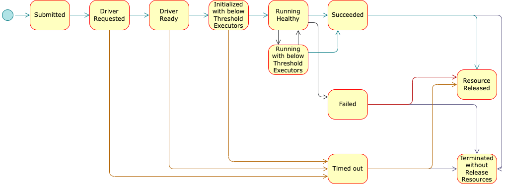

<!--
Licensed to the Apache Software Foundation (ASF) under one
or more contributor license agreements.  See the NOTICE file
distributed with this work for additional information
regarding copyright ownership.  The ASF licenses this file
to you under the Apache License, Version 2.0 (the
"License"); you may not use this file except in compliance
with the License.  You may obtain a copy of the License at

  http://www.apache.org/licenses/LICENSE-2.0

Unless required by applicable law or agreed to in writing,
software distributed under the License is distributed on an
"AS IS" BASIS, WITHOUT WARRANTIES OR CONDITIONS OF ANY
KIND, either express or implied.  See the License for the
specific language governing permissions and limitations
under the License.
-->

# Design & Architecture

**Spark-Kubernetes-Operator** (Operator) acts as a control plane to manage the complete
deployment lifecycle of Spark applications. The Operator can be installed on a Kubernetes
cluster using Helm. In most production environments it is typically deployed in a designated
namespace and controls Spark deployments in one or more managed namespaces. The custom resource
definition (CRD) that describes the schema of a SparkApplication is a cluster wide resource.
For a CRD, the declaration must be registered before any resources of that CRDs kind(s) can be
used, and the registration process sometimes takes a few seconds.

Users can interact with the operator using the kubectl or k8s API. The Operator continuously
tracks cluster events relating to the SparkApplication custom resources. When the operator
receives a new resource update, it will take action to adjust the Kubernetes cluster to the
desired state as part of its reconciliation loop. The initial loop consists of the following
high-level steps:

* User submits a SparkApplication custom resource(CR) using kubectl / API
* Operator launches driver and observes its status
* Operator observes driver-spawn resources (e.g. executors) till app terminates
* Operator releases all Spark-app owned resources to cluster
* The SparkApplication CR can be (re)applied on the cluster any time - e.g. to issue proactive
  termination of an application. The Operator makes continuous adjustments to imitate the
  desired state until the
  current state becomes the desired state. All lifecycle management operations are realized
  using this very simple
  principle in the Operator.

The Operator is built with the Java Operator SDK and uses the Native Kubernetes Integration for
launching Spark deployments and submitting jobs under the hood. The Java Operator SDK is a
higher level
framework and related tooling to support writing Kubernetes Operators in Java. Both the Java
Operator SDK and Spark’s native
kubernetes integration itself is using the Fabric8 Kubernetes Client to interact with the
Kubernetes API Server.

## State Transition

* Spark application are expected to run from submitted to succeeded before releasing resources
* User may configure the app CR to time-out after given threshold of time
* In addition, user may configure the app CR to skip releasing resources after terminated. This is
  typically used at dev phase: pods / configmaps. etc would be kept for debugging. They have
  ownerreference to the Application CR and therefore can still be cleaned up when the owner
  SparkApplication CR is deleted. 
